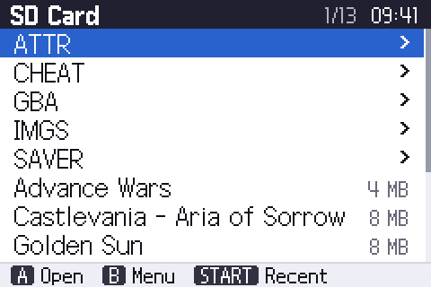
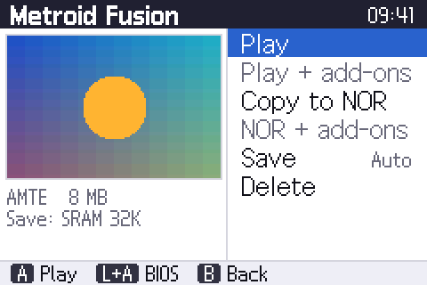

# Omega Kernel

The menu software ("kernel") for the **EZ-FLASH OMEGA** Game Boy Advance flash
cartridge. It lists the games on the microSD card, loads them into the
cartridge's memory, keeps their saves on the card and can add in-game extras
such as save states, cheats and a sleep mode.

<p align="center">
  
  
</p>

This is a rewrite of the [original EZ-FLASH kernel](https://github.com/ez-flash/omega-kernel)
with a new interface, a layered code base, automated tests and documentation.
It stays compatible with what the original kernel stored on the cartridge and
the SD card: saves, save states, settings and games in NOR flash carry over.

## Features

- **Play GBA games from the microSD card** (FAT32 or exFAT), up to 32 MB.
- **Saves are automatic.** Each game gets a `.sav` file in `/SAVER`; the save
  type is detected from a database of 2800+ games and can be overridden.
- **Copy games to NOR flash** (64 MB) so they start instantly, without loading.
- **In-game add-ons**: return to the menu, real-time save states, sleep mode
  and cheats, each switchable in Settings.
- **Recently played** list, folder positions remembered while browsing.
- **Simple, crisp interface**: sharp pixel fonts, one clean list per screen,
  and a bar at the bottom that always shows what each button does.
- **Big box art** (full 120 × 80) on the game page when thumbnails are on the card.
- **Firmware updates**: the kernel offers to update older cartridge firmware.

English only, GBA games only. The original kernel's Chinese interface and its
built-in NES/Game Boy emulators were removed; see the [changelog](CHANGELOG.md).

## Installing

1. Download `ezkernel.bin` from the [latest release](../../releases/latest).
2. Copy it to the root of the microSD card.
3. Hold **R** while turning the GBA on, and confirm the update.

The [user guide](docs/user-guide.md) explains every screen, the settings and
the folders the kernel uses on the SD card.

## Building

The kernel is built with [devkitPro](https://devkitpro.org/wiki/Getting_Started)
(devkitARM and libgba):

```sh
make            # produces ezkernel.bin (the upgrade file) and ezkernel.gba
```

No devkitPro? Build in the official container instead:

```sh
tools/docker-build.sh
```

The tests need only a C compiler, Python 3 and mtools:

```sh
make test       # unit tests + UI simulator, with AddressSanitizer and UBSan
```

See [building](docs/building.md) and [development](docs/development.md) for
details, code style and the release process.

## Documentation

| Document | Contents |
| --- | --- |
| [User guide](docs/user-guide.md) | Using the kernel: screens, controls, settings, troubleshooting |
| [SD card layout](docs/sd-card-layout.md) | Folders and file formats on the SD card and in flash |
| [Architecture](docs/architecture.md) | How the code is organised, memory use, design rules |
| [Hardware](docs/hardware.md) | The OMEGA cartridge: memories, FPGA registers, flash chips |
| [Boot process](docs/boot-process.md) | What happens between pressing "Play" and the game starting |
| [Patching](docs/patching.md) | How the in-game add-ons are installed into games |
| [User interface](docs/user-interface.md) | Design, widgets, fonts |
| [Building](docs/building.md) | Toolchains, build options, memory checks |
| [Development](docs/development.md) | Tests, the UI simulator, code style, CI |
| [Releasing](docs/releasing.md) | Versioning and publishing a release |

API documentation can be generated with `make docs` (Doxygen).

## Repository layout

```
src/            kernel sources (see docs/architecture.md)
  hal/          cartridge hardware: FPGA registers, SD, flash, SRAM, RTC
  core/         portable logic: settings, save types, cheats, paths, ...
  patch/        the game patcher and its payloads
  loader/       files on the SD card, NOR library, starting games
  gfx/ ui/      drawing, fonts and the screens
  platform/     what the UI needs from the machine (GBA or simulator)
  data/         generated game databases
assets/         firmware image, fonts, images, binary patches
tests/          host unit tests and the UI simulator
tools/          build and maintenance scripts
third_party/    FatFs
docs/           documentation
```

## License

Apache License 2.0, see [LICENSE](LICENSE). FatFs is under its own BSD-style
license (`third_party/fatfs`), the Galmuri pixel fonts under the SIL Open Font
License (`assets/fonts/src/OFL.md`).
