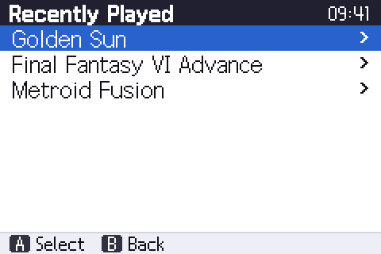
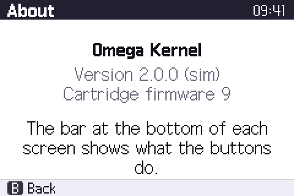
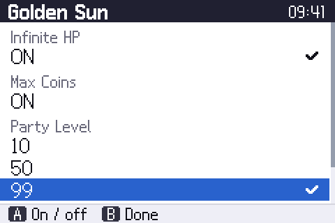
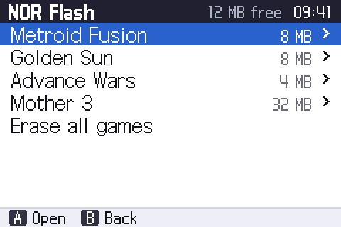
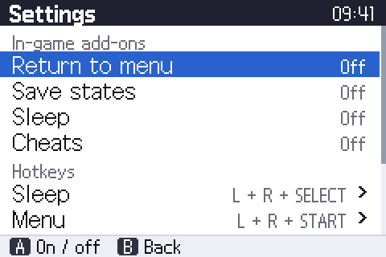
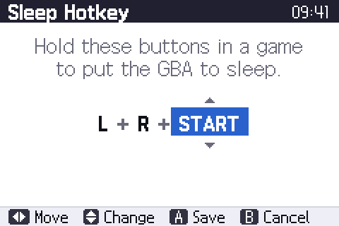
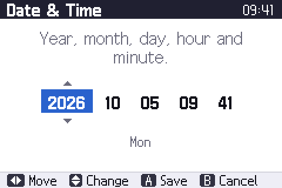

# User guide

This guide covers everything you see and can set in the Omega kernel.
For the folders the kernel creates on the SD card, see
[SD card layout](sd-card-layout.md).

- [Getting started](#getting-started)
- [Controls](#controls)
- [The screens](#the-screens)
- [Starting games](#starting-games)
- [Save types](#save-types)
- [In-game add-ons](#in-game-add-ons)
- [Cheats](#cheats)
- [NOR flash](#nor-flash)
- [Settings](#settings)
- [Box art](#box-art)
- [Firmware updates](#firmware-updates)
- [Troubleshooting](#troubleshooting)

## Getting started

1. Format a microSD card as **FAT32** (or exFAT for cards over 32 GB).
2. Copy your `.gba` games onto it. Folders are fine, as deep as you like.
3. To install or update the kernel, put `ezkernel.bin` in the root of the card,
   hold **R** while turning the GBA on and confirm.
4. Turn the GBA on. The kernel opens the SD card at the game you played last
   (or at the top folder the first time).

The kernel needs no other files. It creates the folders it needs (`/SAVER`,
`/RTS`, `/PATCH`) the first time they are used.

## Controls

The bar at the bottom of every screen shows which buttons do something there
and what they do; it changes with the selected item. In general:

| Button | Action |
| --- | --- |
| **Up / Down** | Move through a list (hold to scroll) |
| **L / R** | Page up / page down in long lists |
| **A** | Open the selected item, or choose it |
| **B** | Go back one screen |
| **START** | In the SD card browser: open Recently Played |
| **Left / Right** | Change a value: the save type on a game page, On / Off in Settings |
| **Hold L + A** | Start a game through the BIOS (Nintendo logo) instead of directly |

The clock in the top-right corner is the cartridge's real-time clock.

## The screens

```
Main menu
├── SD Card ────── folders ─── Game page ─── Cheats
├── NOR Flash ──── Game page (NOR)
├── Recently Played ────────── Game page
├── Settings ───── Date & Time, Sleep / Menu hotkeys
└── About
```

The kernel starts in **SD Card**, in the folder of the game you played last,
with that game selected. Press **B** to go up; in the top folder **B** opens
the main menu.

### SD card browser


Folders come first, then games, each sorted by name. Only `.gba` files are
listed. Hidden and system files are left out, as are the `._` files macOS
leaves on cards. The title bar shows the folder name and your position in the
list. Names too long for the screen scroll when selected. **B** in the top
folder opens the main menu.

The browser remembers where you were in each folder while the GBA is on.
Going up with **B** selects the folder you came from.

File names with accents (`Pokémon - Version Émeraude`), Greek, Cyrillic and
Japanese kana are shown as they are; other characters, such as kanji, are
shown as `?`.

### Game page


Selecting a game opens its page: the box art at full size on the left (if
available, see [Box art](#box-art)) with the game code, size and save type
below it, and the options on the right:

| Option | What it does |
| --- | --- |
| **Play** | Load and start the game as it is, without add-ons. |
| **Play + add-ons** | Start it with the add-ons enabled in Settings. Greyed out if none are enabled. |
| **Copy to NOR** | Write the game into NOR flash, see [NOR flash](#nor-flash). |
| **NOR + add-ons** | The same, with the add-ons built in. |
| **Save** | Use **Left / Right** to override the detected save type. |
| **Cheats** | Only shown when cheats are enabled and a cheat file was found. |
| **Delete** | Delete the game file from the SD card. Its save file is kept. |

### Recently played



The last ten games you started, newest first. Open it from the main menu or
with **START** in the SD card browser.

### About



Shows the kernel version and the cartridge firmware version. Include both
when you report a problem.

## Starting games

When you start a game, the kernel:

1. looks up its save type and finds or creates its save file in `/SAVER`,
2. copies the game from the SD card into the cartridge's PSRAM,
3. adds the add-ons, if you chose **Play + add-ons**,
4. restarts the GBA into the game.

Loading takes a few seconds for large games. Your progress is written back
to the save file on the SD card automatically while you play; you don't need
to return to the kernel for that.

The first start of a game **with add-ons** can take longer: the kernel looks
for the places in the game that it must change. The result is kept in
`/PATCH`, so later starts are as fast as normal ones. With **Fast patching**
enabled (the default) most well-known games skip this step entirely.

## Save types

The kernel recognises the save type of over 2,800 games from their game code.
For a game that isn't in its list (a ROM hack, a prototype, a new
translation), it looks for the name of the save chip that Nintendo's save
library leaves in the game the first time you start it, which takes a few
seconds. The game page shows "Found at start" until then. The result is
remembered in `/SAVER/<game>.mde`. Games without such a name, including most
homebrew, get 64 KB of SRAM, which suits nearly all of them. Detected EEPROM
games get 8K EEPROM; the few that need 512 B must be set by hand.

If a game doesn't save, or complains about its save memory, choose its save
type by hand on the game page (**Save**, then **Left / Right**). The
choice is stored in `/SAVER/<game>.mde` and used from then on, also when the
game is started from NOR flash.

| Choice | Use for |
| --- | --- |
| Auto | The database (default) |
| SRAM | 32 KB SRAM games |
| EEPROM 8K / EEPROM 512 | EEPROM games (most Nintendo first-party titles use 8K) |
| Flash 64K / Flash 128K | Flash games (Pokémon uses 128K) |

Save files are standard 32/64/128 KB, 512 B or 8 KB images and work in
emulators and other flash carts.

## In-game add-ons

Add-ons are small pieces of code the kernel adds to a game when you start it
with **Play + add-ons** (or copy it to NOR with **NOR + add-ons**). Enable them in
**Settings → In-game add-ons**:

| Add-on | What it does in the game |
| --- | --- |
| **Return to menu** | The menu hotkey (default **L + R + START**) returns to the kernel. |
| **Save states** | Save and restore the complete state of the game at any moment. |
| **Sleep** | The sleep hotkey (default **L + R + SELECT**) turns the screen off and pauses the game. Press **SELECT + START** to wake up. |
| **Cheats** | Apply the cheats you selected on the game's cheat screen. |

**Save states only.** When *Save states* is the only add-on enabled, a lighter
version is used and the two hotkeys change meaning: the sleep hotkey **saves**
the state, the menu hotkey **loads** it. Settings shows them as *Save state*
and *Load state*.

**Save states with other add-ons.** Then the menu hotkey opens the
cartridge's in-game menu, where you save or load the state or leave the game.

Save states are stored in `/RTS/<game>.rts` (448 KB each).

A few games don't work with add-ons. If a game crashes or freezes only when
started with add-ons, start it with **Play**.

## Cheats

1. Enable **Settings → Cheats**.
2. Put a cheat file on the card (see below).
3. On the game page, open **Cheats** and select the cheats you want.
4. Start the game with **Play + add-ons**.



Each cheat is a heading with one or more options; selecting an option turns
off the other options of the same cheat. The selection applies when you start
the game from this game page; it is not remembered after you leave the page.

The kernel looks for cheats in two places:

- `/CHEAT/<game name>.cht`, named like the game file, for your own cheats;
- the cheat library: `/CHEAT/GameID2cht.bin` plus the files in
  `/CHEAT/Eng/`, as distributed by EZ-FLASH.

The `.cht` format is described in [SD card layout](sd-card-layout.md#cheat-files).

## NOR flash



The OMEGA has 64 MB of NOR flash. Games copied there start immediately,
without loading from the SD card, and keep their save files on the SD card
like any other game.

- **Copy to NOR** on a game page adds the game after the games already there.
- **NOR Flash** in the main menu lists them, with the free space in the
  title bar.
- Only the game **copied last** can be deleted. To make room otherwise, use
  **Erase all games** at the end of the list. Erasing the chip takes about
  four minutes; don't turn the GBA off meanwhile.

Add-ons are built into a game when it is copied (**NOR + add-ons**), using
the settings of that moment.

## Settings



| Setting | Default | Meaning |
| --- | --- | --- |
| Return to menu | off | See [In-game add-ons](#in-game-add-ons) |
| Save states | off | |
| Sleep | off | |
| Cheats | off | |
| Sleep / Save state hotkey | L + R + SELECT | Three buttons held together in a game |
| Menu / Load state hotkey | L + R + START | |
| Date & Time | | Sets the cartridge clock |
| Clock for games | on | Lets games with a clock (Pokémon, Boktai, ...) read it |
| Fast patching | on | Use the built-in database of patch locations |

Settings are saved in the cartridge when you leave the Settings screen.




In the hotkey and clock editors, **Left / Right** moves between fields, **Up / Down**
changes it, **A** saves and **B** cancels. A hotkey always uses three
different buttons. The weekday follows from the date automatically.

## Box art

The game page shows box art when the card has a thumbnail for the game:
`/IMGS/<first letter>/<second letter>/<game code>.bmp`, for example
`/IMGS/A/M/AMTE.bmp` for Metroid Fusion (USA). The format (120 × 80, 16-bit)
is described in [SD card layout](sd-card-layout.md#thumbnails). Thumbnail
packs made for the original kernel work unchanged.

## Firmware updates

The kernel contains the newest firmware for the cartridge's FPGA. If the
cartridge runs an older version, the kernel offers to update it when the GBA
is turned on. The update takes a few seconds; afterwards turn the GBA off and
on again. **Don't turn it off during the update.**

## Troubleshooting

| Problem | What to try |
| --- | --- |
| "No SD Card" at start-up | Re-insert the card. Check it is FAT32 or exFAT, not NTFS. |
| A game is missing from the list | Only `.gba` files are listed; hidden files are not. Folders can hold up to 512 games and 256 subfolders. |
| "The file is too fragmented" | Copy the game to the card again (or defragment the card). |
| A game doesn't save | Choose its save type by hand on the game page. |
| A game crashes only with add-ons | Use **Play**. Delete `/PATCH/<game>.pat` and try again with **Fast patching** off. |
| Wrong time in games | Set **Settings → Date & Time**; check **Clock for games** is on. |
| Cheats option missing | Enable **Settings → Cheats**; check the cheat file name or the cheat library. |

Bug reports are welcome on the project's issue tracker. Please include the
versions shown in **About**, the game and its game code, and how you started
it.
